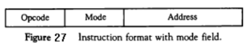
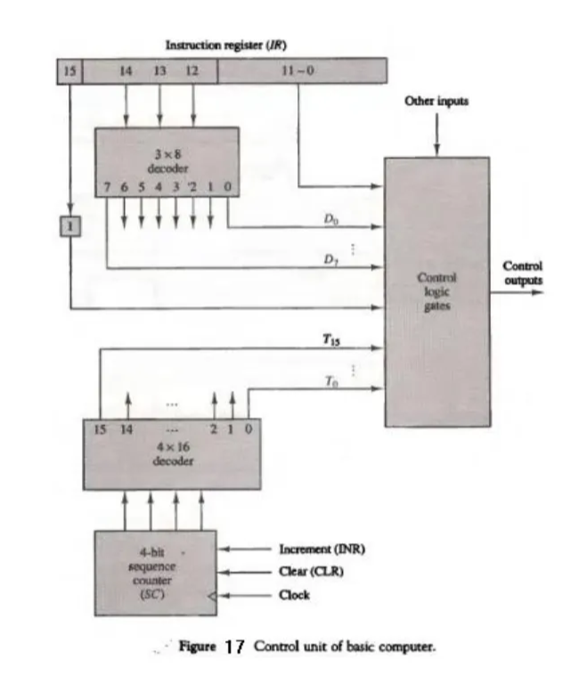

# Basic Computer Organization

Created: November 5, 2024 4:31 PM
Class: BCA 304

# **Addressing Modes**

Computers use addressing mode techniques for the purpose of accommodating one  or 
both of the following provisions:  

**1.**  To  give  programming  versatility  to  the  user  by  providing  such  facilities  as  pointers  to 
memory, counters for loop control, indexing of data, and program relocation.  

**2.** To reduce the number of bits in the addressing field of the instruction. 
PC holds the address of the instruction to be executed next and is incremented each time an 
instruction  is  fetched  from  memory. An  example  of  an  instruction  format  with  a  distinct 
addressing mode field is shown in Fig

1. **Immediate  Mode:**  In  this  mode  the  operand  is  specified  in  the  instruction  itself.  In  other 
words, an immediate-mode instruction has an operand field rather than an address field.
2. **Register  Mode:**  In  this mode  the operands  are  in  registers  that  reside within  the  CPU. The 
particular register is selected from a register field in the instruction. 
3. **Register Indirect Mode:** In this mode the instruction specifies a register in the CPU whose 
contents give the address of the operand in memory.
4. **Auto-increment  or  Auto-decrement  Mode:**  This  is  similar  to  the  register  indirect  mode 
except  that  the  register  is  incremented  or  decremented  after  (or  before)  its  value  is  used  to 
access memory. 
***** The  effective  address  is  defined  to  be  the  memory  address  obtained  from  the  computation 
dictated by the given addressing mode.  
****
5. **Direct  Address Mode:** In this mode the effective address is equal to the address part of the 
instruction. 
6. **Indirect  Address  Mode:**  In  this  mode the address field  of  the instruction gives  the  address 
where the effective address is stored in memory. 
The effective address in these modes is obtained from the following computation: 
effective address = address part of instruction + content of CPU register 
7. **Relative  Address  Mode:**  In  this  mode  the  content  of  the  program  counter  is  added  to  the 
address part of the instruction in order to obtain the effective address.
8. **Indexed  Addressing  Mode:**  In  this  mode  the  content  of  an  index  register  is  added  to  the 
address part of the instruction to obtain the effective address. 
**Base Register Addressing Mode:** In this mode the content of a base register is added to the 
address part of the instruction to obtain the effective address

# **Timing and Control**

The timing for  all  registers in the basic  computer is controlled by  a  master  clock  generator. 
The  clock  pulses  are applied  to  all flip-flops  and  registers  in the  system, including the  flip-
flops and registers in the control unit. The control signals are generated in the control unit and 
provide  control  inputs  for  the  multiplexers  in  the  common  bus,  control  inputs  in  processor 
registers, and microoperations for the accumulator. 
There are two major types of control organization:  
1- hardwired control : the control logic is implemented with gates, flip-flops, decoders, 
and other digital circuits. It has the advantage that it can be optimized to produce a fast 
mode of operation. 
2- microprogrammed control: the control information is stored in a control memory. The 
control memory is programmed to initiate the required sequence of microoperations.

SC is incremented with every positive clock transition, unless its CLR input is active. 
This produces the sequence of timing signals T0, T1, T2, T3, T4, and so on, as shown in the 
diagram.  (Note  the  relationship  between  the  timing  signal  and  its  corresponding  positive **clock** transition.) If SC is not cleared, the timing signals will continue with T5, T6, up to T15 and back to T0. 
As an example, consider the case where SC is incremented to provide timing signals T0, T1 ,T2, T3,and T 4 in sequence. At time T4, SC is cleared to 0 if decoder output D3 is active. This 
is expressed symbolically by the statement
